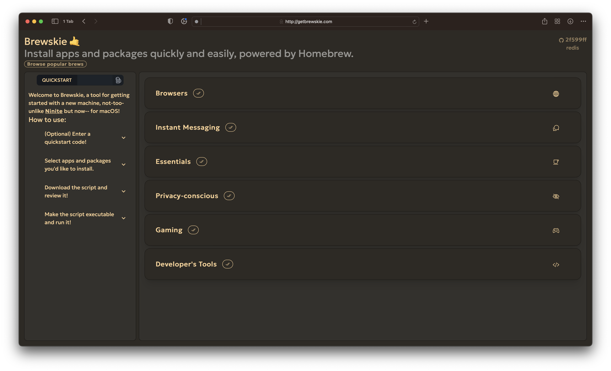

# Brewskie

## A transparent and safe [Ninite](https://www.ninite.com/) alternative for macOS, built with tried-and-tested tools!

> Using [SvelteKit](https://www.svelte.dev), Brewskie delivers a Brewfile for use when setting up a new Mac device using [Homebrew](https://www.brew.sh) Formulae (packages, runtimes) and Casks (apps).

Brewskie provides a slick interface that lets you pick and your favorite, most popular apps and install them in minutes.

To donate to Homebrew, you can visit their [donation page](https://github.com/homebrew/brew#donations).
